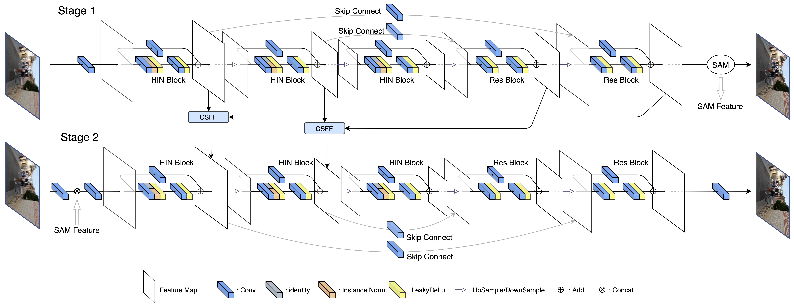

[](https://paperswithcode.com/sota/image-denoising-on-sidd?p=hinet-half-instance-normalization-network-for)
[](https://paperswithcode.com/sota/deblurring-on-gopro?p=hinet-half-instance-normalization-network-for)
[](https://paperswithcode.com/sota/single-image-deraining-on-rain100h?p=hinet-half-instance-normalization-network-for)
[](https://paperswithcode.com/sota/single-image-deraining-on-rain100l?p=hinet-half-instance-normalization-network-for)
[](https://paperswithcode.com/sota/single-image-deraining-on-test100?p=hinet-half-instance-normalization-network-for)
[](https://paperswithcode.com/sota/single-image-deraining-on-test1200?p=hinet-half-instance-normalization-network-for)
[](https://paperswithcode.com/sota/single-image-deraining-on-test2800?p=hinet-half-instance-normalization-network-for)
[](https://paperswithcode.com/sota/image-deblurring-on-gopro?p=hinet-half-instance-normalization-network-for)

HINet: Half Instance Normalization Network for Image Restoration
---
#### Liangyu Chen, Xin Lu, Jie Zhang, Xiaojie Chu, Chengpeng Chen
#### Paper: https://arxiv.org/abs/2105.06086
> In this paper, we explore the role of Instance Normalization in low-level vision tasks. Specifically, we present a novel block: Half Instance Normalization Block (HIN Block), to boost the performance of image restoration networks. Based on HIN Block, we design a simple and powerful multi-stage network named HINet, which consists of two subnetworks. With the help of HIN Block, HINet surpasses the state-of-the-art (SOTA) on various image restoration tasks. For image denoising, we exceed it 0.11dB and 0.28 dB in PSNR on SIDD dataset, with only 7.5% and 30% of its multiplier-accumulator operations (MACs), 6.8 times and 2.9 times speedup respectively. For image deblurring, we get comparable performance with 22.5% of its MACs and 3.3 times speedup on REDS and GoPro datasets. For image deraining, we exceed it by 0.3 dB in PSNR on the average result of multiple datasets with 1.4 times speedup. With HINet, we won 1st place on the NTIRE 2021 Image Deblurring Challenge - Track2. JPEG Artifacts, with a PSNR of 29.70.

### Network Architecture


### News
**2022.04.12** Our new work, [**Simple Baselines for Image Restoration**](https://arxiv.org/abs/2204.04676) reveals the nonlinear activation functions, e.g. ReLU, GELU, Sigmoid, and etc. are **not necessary** to achieve SOTA performance. The paper provide a simple baseline, NAFNet: Nonlinear Activation Free Network for Image Restoration tasks, and acheves SOTA performance on Image Denoising and Image Deblurring. The paper and the code are available at https://arxiv.org/abs/2204.04676 / https://github.com/megvii-research/NAFNet respectively.

**2021.12.10** Our new work, [**Revisiting Global Statistics Aggregation for Improving Image Restoration**](https://arxiv.org/abs/2112.04491), exceeds the previous SOTA restorers **0.6** dB (GoPro dataset) **without** re-train the model. It is accomplished by revealing the feature distribution shifts issue from training phase to testing phase. The paper and the code are available at https://arxiv.org/abs/2112.04491 / https://github.com/megvii-research/tlsc respectively. 

### Installation

This implementation based on [BasicSR](https://github.com/xinntao/BasicSR) which is a open source toolbox for image/video restoration tasks. 

```python
python 3.6.9
pytorch 1.5.1
cuda 10.1
```


```
git clone https://github.com/megvii-model/HINet
cd HINet
pip install -r requirements.txt
python setup.py develop --no_cuda_ext
```

### Quick Start (Single Image Inference)
---

* ```python basicsr/demo.py -opt options/demo/demo.yml```
  * modified your [input and output path](https://github.com/megvii-model/HINet/blob/main/options/demo/demo.yml#L16-L17)
  * [define network](https://github.com/megvii-model/HINet/blob/main/options/demo/demo.yml#L20-L24)
  * [pretrained model](https://github.com/megvii-model/HINet/blob/main/options/demo/demo.yml#L28), it should match the define network.
     * for pretrained model, see [here](https://github.com/megvii-model/HINet/blob/main/experiments/pretrained_models/README.md)

### Image Restoration Tasks
---

Image denoise, deblur, derain.

<details><summary>Image Denoise - SIDD dataset (Click to expand) </summary>

* prepare data

  * ```mkdir ./datasets/SIDD ```
  
  * download the [train]( SIDD-Medium sRGB Dataset in https://www.eecs.yorku.ca/~kamel/sidd/dataset.php) set and unzip it. Then move Data (./SIDD_Medium_Srgb/Data) set to ./datasets/SIDD/ . Download [val](https://www.eecs.yorku.ca/~kamel/sidd/benchmark.php) files (ValidationNoisyBlocksSrgb.mat and ValidationGtBlocksSrgb.mat) in ./datasets/SIDD/ .
  * it should be like:
  
    ```bash
    ./datasets/SIDD/Data
    ./datasets/SIDD/ValidationNoisyBlocksSrgb.mat
    ./datasets/SIDD/ValidationGtBlocksSrgb.mat
    ```
  
  * ```python scripts/data_preparation/sidd.py```
  
    * crop the train image pairs to 512x512 patches.


* eval
  * download [pretrained model](https://drive.google.com/file/d/1Y5YJQVNL0weifE--5us344bLwzBNS_sU/view?usp=sharing, https://drive.google.com/file/d/1CU5z-M90Jc-TAcVpEaFjDCYA09fkubGi/view?usp=sharing) to ./experiments/pretrained_models/HINet-SIDD-0.5x.pth
  (HINet-SIDD-1x.pth)  (we use the output computing directly from hinet to avoid the psnr loss caused by the "round()" operation, which is the same way using in other networks. For SSIM, our results are higher than those of MATLAB, so only PSNR is reported here)
  * ```python basicsr/test.py -opt options/test/SIDD/HINet-SIDD-0.5x.yml (HINet-SIDD-1x.yml) ```
  
* train

  * ```python -m torch.distributed.launch --nproc_per_node=8 --master_port=4321 basicsr/train.py -opt options/train/SIDD/HINet.yml(HINet_0.5x.yml) --launcher pytorch```
  * data in lmdb format will lose about 0.01 value in PSNR

</details>

<details>
  <summary>Image Deblur - GoPro dataset (Click to expand) </summary>

* prepare data

  * ```mkdir ./datasets/GoPro ```
  
  * download the [train](https://drive.google.com/drive/folders/1AsgIP9_X0bg0olu2-1N6karm2x15cJWE) set in ./datasets/GoPro/train and [test](https://drive.google.com/drive/folders/1a2qKfXWpNuTGOm2-Jex8kfNSzYJLbqkf) set in ./datasets/GoPro/test (refer to [MPRNet](https://github.com/swz30/MPRNet)) 
  * it should be like:
  
    ```bash
    ./datasets/
    ./datasets/GoPro/
    ./datasets/GoPro/train/
    ./datasets/GoPro/train/input/
    ./datasets/GoPro/train/target/
    ./datasets/GoPro/test/
    ./datasets/GoPro/test/input/
    ./datasets/GoPro/test/target/
    ```
  
  * ```python scripts/data_preparation/gopro.py```
  
    * crop the train image pairs to 512x512 patches.


* eval
  * download [pretrained model](https://drive.google.com/file/d/1dw8PKVkLfISzNtUu3gqGh83NBO83ZQ5n/view?usp=sharing) to ./experiments/pretrained_models/HINet-GoPro.pth
  * ```python basicsr/test.py -opt options/test/GoPro/HINet-GoPro.yml  ```
  
* train

  * ```python -m torch.distributed.launch --nproc_per_node=8 --master_port=4321 basicsr/train.py -opt options/train/GoPro/HINet.yml --launcher pytorch```

</details>


<details><summary> Image Deblur - REDS dataset (Click to expand) </summary>

* prepare data


  * ```mkdir ./datasets/REDS```

  * download the train / val set from [train_blur](https://drive.google.com/file/d/1VTXyhwrTgcaUWklG-6Dh4MyCmYvX39mW/view?usp=sharing), [train_sharp](https://drive.google.com/file/d/1YLksKtMhd2mWyVSkvhDaDLWSc1qYNCz-/view?usp=sharing), [val_blur](https://drive.google.com/file/d/1EqQljcGMcm5oCr71KpMfXREPXV3lpMGW/view?usp=sharing), [val_sharp](https://drive.google.com/file/d/1MGeObVQ1-Z29f-myDP7-8c3u0_xECKXq/view?usp=sharing) to ./datasets/REDS/ and unzip them.

  * it should be like

    ```
    ./datasets/
    ./datasets/REDS/
    ./datasets/REDS/val/
    ./datasets/REDS/val/val_blur_jpeg/
    ./datasets/REDS/val/val_sharp/
    ./datasets/REDS/train/
    ./datasets/REDS/train/train_blur_jpeg/
    ./datasets/REDS/train/train_sharp/
    ```

  * ```python scripts/data_preparation/reds.py```


    * flatten the folders and extract 300 validation images.

* eval


  * download [pretrained model](https://drive.google.com/file/d/1uYH8XvLgrn-Vg6L0NjUcO2Fblhqrc8TU/view?usp=sharing) to ./experiments/pretrained_models/HINet-REDS.pth
  * ```python basicsr/test.py -opt options/test/REDS/HINet-REDS.yml``` 

* train


  * ```python -m torch.distributed.launch --nproc_per_node=8 --master_port=4321 basicsr/train.py -opt options/train/REDS/HINet.yml --launcher pytorch```

  

</details>

<details> <summary> Image Derain - Rain13k dataset (Click to expand) </summary>

* prepare data


  * ```mkdir ./datasets/Rain13k```

  * download the [train](https://drive.google.com/drive/folders/1Hnnlc5kI0v9_BtfMytC2LR5VpLAFZtVe?usp=sharing) set and [test](https://drive.google.com/drive/folders/1PDWggNh8ylevFmrjo-JEvlmqsDlWWvZs?usp=sharing) set (refer to [MPRNet](https://github.com/swz30/MPRNet))

  * it should be like

    ```
    ./datasets/
    ./datasets/Rain13k/
    ./datasets/Rain13k/train/
    ./datasets/Rain13k/train/input/
    ./datasets/Rain13k/train/target/
    ./datasets/Rain13k/test/
    ./datasets/Rain13k/test/Test100/
    ./datasets/Rain13k/test/Rain100H/
    ./datasets/Rain13k/test/Rain100L/
    ./datasets/Rain13k/test/Test2800/
    ./datasets/Rain13k/test/Test1200/
    ```

* eval


    * download [pretrained model](https://drive.google.com/file/d/1AVedAkb1B2F2b3XGWlMFFVSsNfQlCwxa/view?usp=sharing) to ./experiments/pretrained_models/HINet-Rain13k.pth
    
    * For Test100:

      * ```python basicsr/test.py -opt options/test/Rain13k/HINet-Test100.yml``` 
    * For Rain100H

      * ```python basicsr/test.py -opt options/test/Rain13k/HINet-Rain100H.yml``` 
    * For Rain100L

      * ```python basicsr/test.py -opt options/test/Rain13k/HINet-Rain100L.yml``` 
    * For Test2800

      * ```python basicsr/test.py -opt options/test/Rain13k/HINet-Test2800.yml``` 
    * For Test1200

      * ```python basicsr/test.py -opt options/test/Rain13k/HINet-Test1200.yml``` 

* train

    * ```python -m torch.distributed.launch --nproc_per_node=8 --master_port=4321 basicsr/train_rain.py -opt options/train/Rain13k/HINet.yml --launcher pytorch```

</details>


### Results

---
Some of the following results are higher than the original paper as we optimized some hyper-parameters.


<div align="center">

</div>


<div align="center">

</div>


### License

This project is under the MIT license, and it is based on [BasicSR](https://github.com/xinntao/BasicSR) which is under the Apache 2.0 license.


### Citations

If HINet helps your research or work, please consider citing HINet.
```
@InProceedings{Chen_2021_CVPR,
    author    = {Chen, Liangyu and Lu, Xin and Zhang, Jie and Chu, Xiaojie and Chen, Chengpeng},
    title     = {HINet: Half Instance Normalization Network for Image Restoration},
    booktitle = {Proceedings of the IEEE/CVF Conference on Computer Vision and Pattern Recognition (CVPR) Workshops},
    month     = {June},
    year      = {2021},
    pages     = {182-192}
}
```

### Contact
If you have any questions, please contact chenliangyu@megvii.com or luxin@megvii.com .
